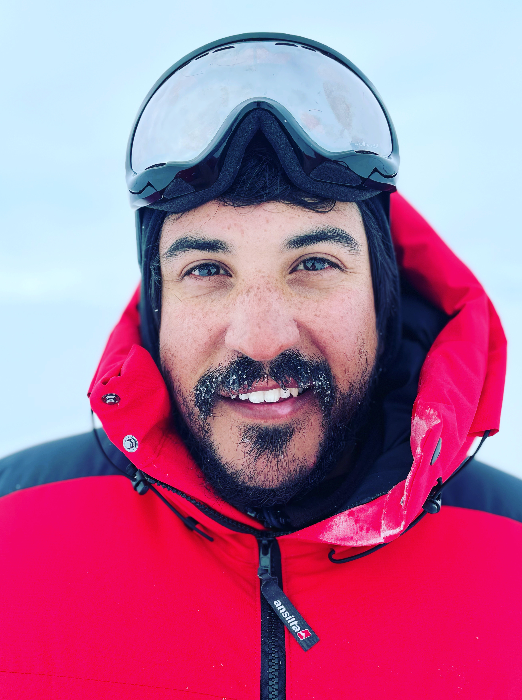
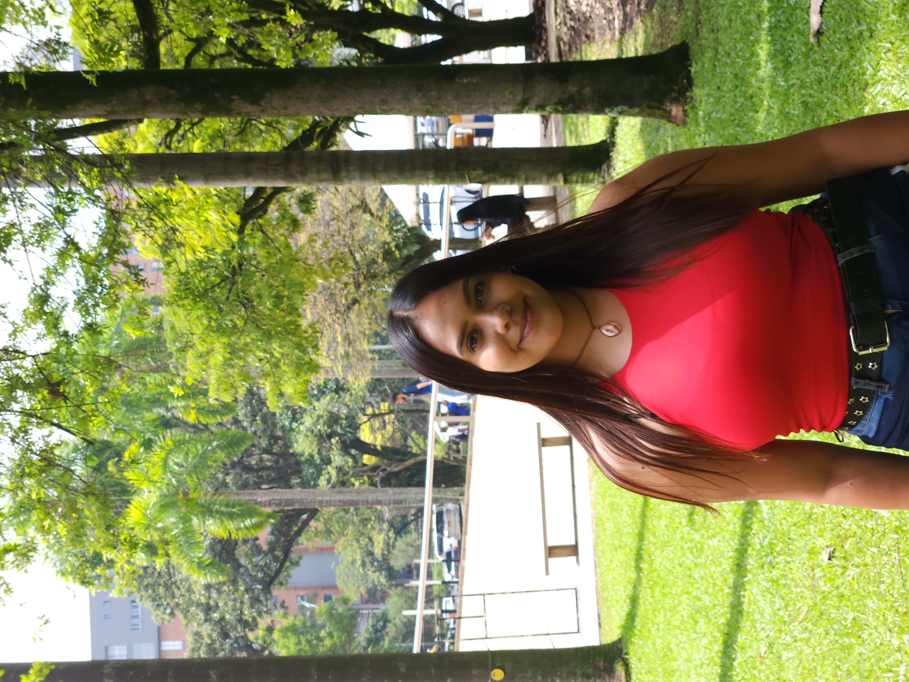
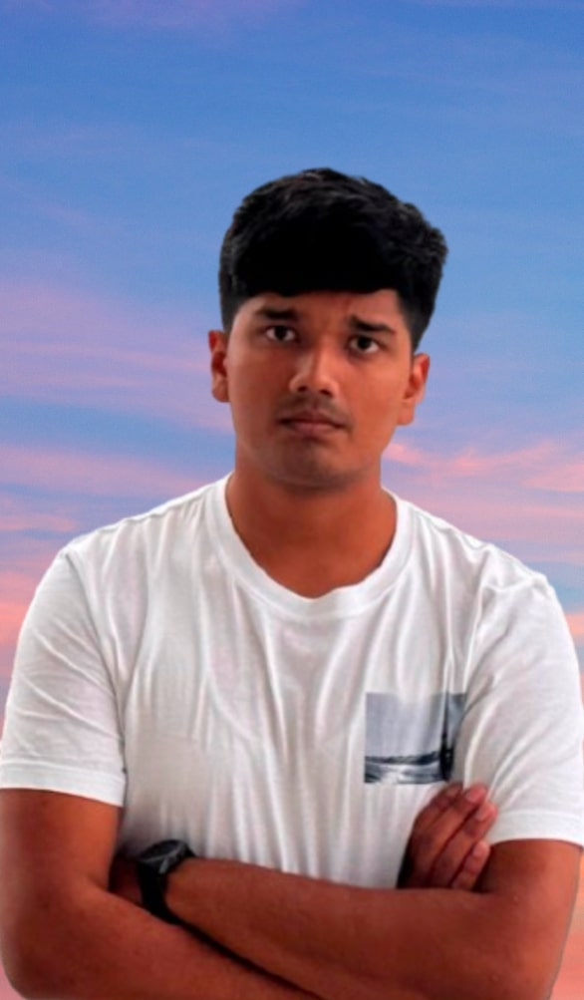
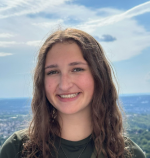

{:class="float-left"}{:height='300'}

**Principal Investigator - Sylvia Sullivan**

Sylvia is an Assistant Professor at the University of Arizona since January 2022. She has spent time as a fellow at the Karlsruhe Institute of Technology and a postdoctoral researcher at Columbia University. She earned her doctorate from the Georgia Institute of Technology in 2017 and her bachelors from the California Institute of Technology in 2012, both in chemical engineering with concentrations on earth and environmental sciences. In her free time, she is an avid runner, reader, and language buff.

**[Sylvia's CV](/Files/CV-SSullivan.pdf)**

{:class="float-left"}{:height='300'}

**Doctoral Student - Thabo Makgoale**

Thabo is a Ph.D. student in Hydrology & Atmospheric Sciences, focusing on the effect of ice microphysics within tropical mesoscale convective systems using storm-resolving simulations. Mr. Makgoale has been working as a research scientist in Climate Change and Variability for almost 7 years at the South African Weather Services (SAWS). He completed his Bachelors degree in Ocean and Atmospheric Sciences in 2012 and his honours degree in Atmospheric Sciences in 2013, both from the University of Cape Town through the Climate System Analysis Group (CSAG). He completed his Masters degree in Geography and Environmental Management at North-West University (NWU) in 2021 with a thesis investigating the sensitivity of simulated temperatures in climate models to aerosols over southern Africa.

{:class="float-left"}{:height='300'}

**Doctoral Student - Edgardo Sepúlveda Araya**

Edgardo is a Ph.D. student in Environmental Engineering, focusing on the radiative effect of cloud ice optics schemes in storm-resolving simulations. He has been working as an Associate Researcher in the Antarctic Research Group in the Department of Physics at the University of Santiago of Chile with interest in climate change impacts in Chile and Antarctica. He received his Bachelors in Applied Physics in 2015 and his Diplom in Physics Engineering in 2021, both from the University of Santiago of Chile. Over the last 6 years, Edgardo has been involved in a series of field campaigns from the Atacama Desert in northern Chile to Union Glacier in Antarctica, with studies focused mainly on UV radiation, the Antarctic ozone hole and radiative effects of clouds on the Antarctic Peninsula. Edgardo spends most of his free time playing music and listening to different styles of music, jazz being one of his favorites.

{:class="float-left"}{:height='300'}

**Doctoral Student - Juliana Mejía Sepúlveda**

Juliana will start her Ph.D. in Environmental Engineering in Fall 2023. She will help build up our lab space, characterizing ice nucleation ability of various soils and desert aerosols and generating seed crystals for optical characterization. Juliana is originally from Colombia and received her Environmental Engineering Bachelor and Masters degree from the University of Antioquia. She joined different projects associated with heterogeneous photocatalysis using titanium dioxide and chemical characterization of PM10. Juliana is an animal lover, taekwondo blue belt, enjoys hiking and is passionate about astronomy.

{:class="float-left"}{:height='250'}

**Undergraduate Student - Akshat Singh**

Akshat is an undergraduate junior majoring in Computer Science. He will be working on a project exploring GPU-accelerated visualization techniques for high-resolution atmospheric model outputs using ParaView and NCAR VAPOR. His work will also involve creating animations and interactive Python widgets to analyze and present atmospheric data effectively. In his free time, Akshat enjoys swimming and exploring advancements in AI and computational sciences.

{:class="float-left"}{:height='250'}

**Undergraduate Student - Hannah Golden**

Hannah is an undergraduate student majoring in Chemical Engineering. She will be helping to construct filter samplers for installation around the UofA and elsewhere to monitor atmospheric dust loadings and measure the ice-nucleating efficiency of that airborne dust. In her free time, Hannah loves hiking, reading and traveling.

--

## Former Group Members

**Undergraduate Student - Linda Engelman** - Environmental Engineer at Baxter & Woodman, Austin, TX

**Undergraduate Student - Tanmay Agrawal** - Master's Student in Computer Science at the University of Arizona

--
## Group Principles

Our research group is guided by the following principles:

1.	Curiosity – Questions, especially fundamental ones, are always welcome, and we do not dismiss new ideas without thought. Question-asking and openness to different perspectives are the ways in which we grow intellectually.

2.	Inclusivity – Building a group of people with different backgrounds is important to us. Diversity of thought and experience not only generate more interesting ideas but also help us to circumvent confirmation bias.*

3.	Collaboration – Along similar lines, our culture is collaborative not competitive. Asking for help and feedback is strongly encouraged when others’ time is respected. We actively seek to work with others and give credit where credit is due.

4.	Communication – We want to be communicative about our scientific results – within the immediate group, the larger scientific community, and the broader public – but also when interpersonal conflicts arise.

5.	Rest - Research is a creative endeavor, and rest is crucial to foster this creativity. It is important to take time off. Prioritization and saying no respectfully are important skills to learn.

6.	Reproducibility – Especially as the volume of research output expands, it is essential that our results be reproducible. We value high-quality work performed more slowly and methodically over high-quantity work performed more quickly and sloppily.

\* *“If you put individuals together in the right way, such that some individuals can use their reasoning powers to disconfirm the claims of others, and all individuals feel some common bond or shared fate that allows them to interact civilly, you can create a group that ends up producing good reasoning .... This is why it’s so important to have intellectual and ideological diversity within any group or institution whose goal is to find truth.”*
Jonathan Haidt, The Righteous Mind

