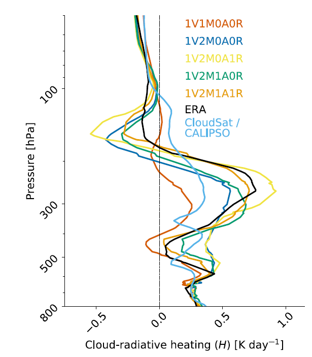
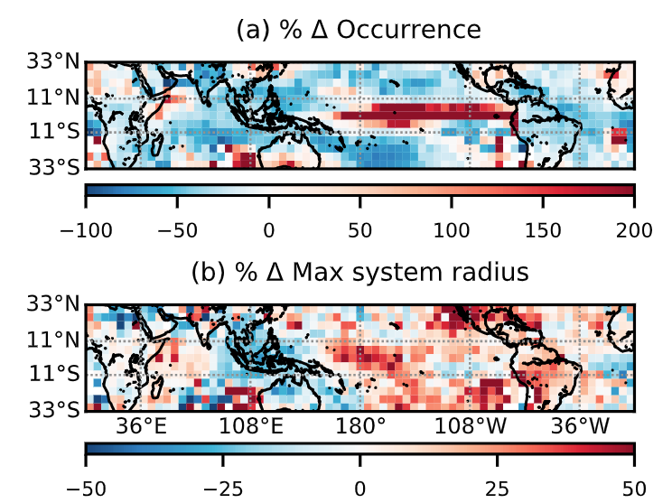
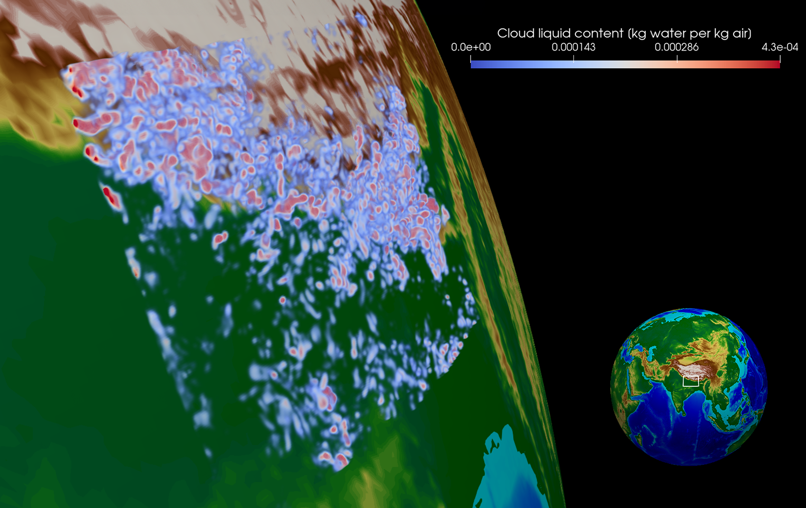
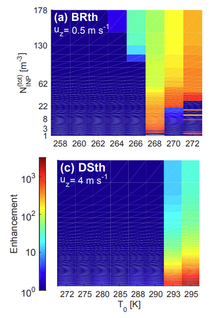
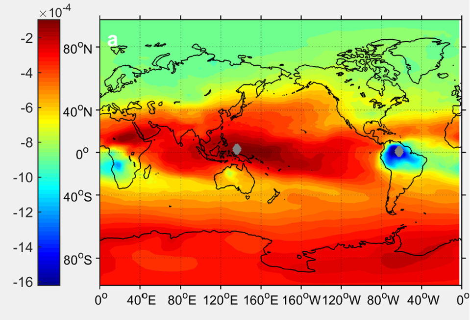

## Radiative heating from ice clouds

{:class="float-right"}{:height='330'}

We are broadly interested in the impact of ice clouds on the terrestrial radiative budget. How does the presence of cirrus change infrared radiative fluxes exiting at the top of the atmosphere? How does the presence of cirrus change radiative heating within the atmosphere, and hence the temperature gradients that drive circulation? Most recently, in a series of simulations with a range of horizontal grid spacings and microphysics and convection schemes, we find in [this study](https://egusphere.copernicus.org/preprints/2023/egusphere-2023-109/) that the combination of microphysical and convective representation is more influential on upper-tropospheric cloud-radiative heating rates than the grid spacings. These simulations are centered over the North Atlantic region, whereas our other studies of cloud-radiative heating focus on the strong ice microphysical control in the tropics. Edgardo is building upon this research theme by investigating the effect of ice optics schemes on this upper-tropospheric cloud-radiative heating.

**Publications**

S. C. Sullivan, A. Voigt, C. Rolf, and M. Krämer (2023). Evaluation of simulated upper-tropospheric lower-stratospheric properties over the Asian monsoon region. *[in preparation for Geophys. Res. Lett.]*

S. C. Sullivan, B. Keshtgar, N. Albern, E. Bala, C. Braun, A. Choudhary, J. Hörner, B. Keshtgar, H. Lentink, and G. Papavasileiou (2023). **[How does cloud-radiative heating over the North Atlantic change with grid spacing, convective parameterization, and microphysics scheme?](https://gmd.copernicus.org/articles/16/3535/2023/)** *Geosci. Model Devel.* 16 (2): 3535-3551 doi: 10.5194/gmd-16-3535-2023.

S. C. Sullivan, A. Voigt, A. Miltenberger, C. Rolf, and M. Krämer (2022). **[A Lagrangian perspective of microphysical impact on ice cloud evolution and radiative heating](https://agupubs.onlinelibrary.wiley.com/doi/epdf/10.1029/2022MS003226)** *J. Adv. Model Earth Sys.* doi: 10.1029/2022MS003226.

S. C. Sullivan and A. Voigt (2021). **[Ice microphysical processes exert a strong control on the simulated radiative energy budget in the tropics](https://www.nature.com/articles/s43247-021-00206-7#MOESM1)** *Comm. Earth & Env.* 2 (137) doi: 10.1038/s43247-021-00206-7.

S. C. Sullivan and A. Voigt (2021). [Comms Earth & Env blog post](https://sustainabilitycommunity.springernature.com/posts/how-ice-crystals-heat-the-atmosphere?channel_id=behind-the-paper) /// [KIT press release](https://www.kit.edu/kit/29383.php) /// [Uni Wien press release](https://fgga.univie.ac.at/forschung/forschungsportal-detailansicht/news/wie-eiswolken-die-atmosphaere-aufheizen/?tx_news_pi1%5bcontroller%5d=News&tx_news_pi1%5baction%5d=detail&cHash=591b989b86849d39d4966129bd475560)

## Precipitation statistics and satellite climatologies of mesoscale convective systems

{:class="float-right"}{:height='300'}

Mesoscale convective systems (MCSs) are large thunderstorms organized over hundreds of kilometers, responsible for the majority of intense rainfall throughout the tropics. We are interested in the precipitation from MCSs---how it varies with environmental conditions, modes of tropical variability, and between simulations and observations. A few years ago now, we built a collocated dataset of ISCCP convective tracking data (1983-2008), precipitation rates (MSWEP), and synoptic conditions (ERA-Interim). From these datasets, we generated climatologies of organized convective structure, their associated precipitation, and environmental conditions in the warm and cold phases of El Niño (<a href="/codes-and-slides">MCS collocation scripts</a>). Simple information entropy metrics were used to quantify proximity of convective occurrence (<a href="/codes-and-slides">Entropy algorithm</a>), and most recently the surface energy and vertical momentum budgets were used to explain warm-cold phase differences in the distribution of precipitation intensities. This research theme continues using output of radiative-convective equilibrium simulations and cloud-resolving simulations. For example, Thabo is evaluating precipitation efficiencies from the DYAMOND intercomparison output. 

**Publications**

S. Chakraborty, S. C. Sullivan, and Z. Feng (2022). An Overview of Mesoscale Convective Systems: Global Climatology, Satellite Observations, and Modelling Strategies. *[Accepted at Geophys. Monog. Series.]*

S. C. Sullivan, K. A. Schiro, J. Yin, and P. Gentine (2020). **[Change in tropical precipitation intensity with El Niño warming](https://agupubs.onlinelibrary.wiley.com/doi/10.1029/2020GL087663)** *Geophys. Res. Lett.* 47 (14) e2020GL087663.

K. A. Schiro, S. C. Sullivan, Y.-H. Kuo, H. Su, P. Gentine, G. S. Elsaesser, J. H. Jiang, and J. David Neelin (2020). **[Environmental controls on tropical mesoscale convective system precipitation intensity](https://journals.ametsoc.org/jas/article/doi/10.1175/JAS-D-20-0111.1/354632/Environmental-controls-on-tropical-mesoscale)** *J. Atmos. Sci.* doi: 10.1175/JAS-D-20-0111.1

S. C. Sullivan, K. A. Schiro, C. A. Stubenrauch, and P. Gentine (2019). **[The response of tropical organized convection to El Niño Warming](https://agupubs.onlinelibrary.wiley.com/doi/abs/10.1029/2019JD031026)** *J. Geophys. Res.* 124 (15) pp. 8481--8500.

## Visualization techniques for clouds \& climate

{:class="float-right"}{:height='300'}

We are beginning to explore how visualization techniques can support research on clouds \& climate with support from an NCAR Collaborative Opportunity for Research Engagement (CORE). Atmospheric models are now run at very fine grid spacings, which is both an opportunity and a challenge. We are resolving features necessary to understand clouds and storms but must develop clever ways to extract meaning from large volumes of data. Can visualization inform cloud classifications, teach us about across-scale interactions, or improve our methods for model-observation comparison?

## Parcel and mesoscale modeling of secondary ice production

{:class="float-right"}{:height='300'}

We have built a mixed-phase microphysics parcel model to describe secondary ice production processes like collisional breakup and rime splintering (<a href="/codes-and-slides">SIM codes</a>). With this idealized model, we generated estimates of the ice crystal number enhancement from secondary processes, as well as the impact of hydrometeor non-sphericity and updraft fluctuations. More sophisticated parameterizations of these processes were later developed for the COSMO metoeorological model of the German Weather Service and contributed to a review article on observations and modeling of these secondary processes.

**Publications**

G. Sotiropoulou, S. C. Sullivan, J. Savre, G. Lloyd, T. Lachlan-Cope, A. Ekman, and A. Nenes (2020). **[The impact of secondary ice production on Arctic stratocumulus](https://www.atmos-chem-phys.net/20/1301/2020/)**. *Atmos. Chem. Phys.* 20 pp. 1301-1316. 

S. C. Sullivan, C. Barthlott, J. Crosier, I. Zhukov, A. Nenes, and C. Hoose (2018). **[The effect of secondary ice production parameterization on the simulation of a cold frontal rainband](https://www.atmos-chem-phys.net/18/16461/2018/acp-18-16461-2018.pdf)** *Atmos. Chem. Phys.* 18 pp. 16461--16480.

S. C. Sullivan, C. Hoose, A. Kiselev, T. Leisner, and A. Nenes (2018). **[Initiation of secondary ice production in clouds](https://www.atmos-chem-phys.net/18/1593/2018/acp-18-1593-2018.pdf)** *Atmos. Chem. Phys.* 18 pp. 1593--1610.

P. R. Field et al. (2017). **[Secondary ice production: Current state of the science and recommendations for the future](https://journals.ametsoc.org/mono/article/doi/10.1175/AMSMONOGRAPHS-D-16-0014.1/28239/Secondary-Ice-Production-Current-State-of-the)** *Meteor. Monogr.* 58: 7.1-7.20.

S. C. Sullivan, C. Hoose, and A. Nenes (2017). **[Investigating the contribution of secondary ice production to in‐cloud ice crystal numbers](https://agupubs.onlinelibrary.wiley.com/doi/full/10.1002/2017JD026546)** *J. Geophys. Res.* 122 (17) pp. 9391--9412.

## Sensitivity and attribution analyses for ice nucleation

{:class="float-right"}{:height='300'}

Computationally efficient sensitivity and attribution analyses can be performed with automatic differentiation of parameterization codes in large-scale models. The resultant *adjoint model* obviates the need for finite differencing, as an output perturbation is back-propagated through to various input perturbations. We have built adjoints from the ice nucleation codes in the Community Atmosphere Model and the Goddard Earth-Observing model and used these to identify nucleation regime shifts, quantify aerosol nucleation efficiencies, and define temporal attribution metrics.

**Publications**

S. Bacer, S. Sullivan, H. Tost, J. Lelieveld, and A. Pozzer (2021). **[Cold cloud microphysical process rates in a global chemistry-climate model](https://acp.copernicus.org/articles/21/1485/2021/acp-21-1485-2021.pdf)** *Atmos. Chem. Phys.* 21 pp. 1485–1505.

S. Bacer, S. Sullivan, V. A. Karydis, D. Barahona, A. Nenes, H. Tost, A. P. Tsimpidi, J. Lelieveld, and A. Pozzer (2018). **[Implementation of a comprehensive ice crystal formation parameterization into the EMAC model](https://www.geosci-model-dev.net/11/4021/2018/)** *Geosci. Model Devel.* 11 pp. 4021--4041.

S. C. Sullivan, D. Lee, L. Oreopoulos, and A. Nenes (2016). **[Role of updraft velocity in temporal variability of global cloud hydrometeor number](https://www.pnas.org/content/113/21/5791)** *Proc. Nat. Acad. Sci.* 113 (21) pp. 5791--5796.

S. C. Sullivan, R. Morales, D. Barahona, and A. Nenes (2016). **[Understanding cirrus ice crystal number variability for different heterogeneous ice nucleation spectra](https://www.atmos-chem-phys.net/16/2611/2016/acp-16-2611-2016.pdf)** *Atmos. Chem. Phys.* 16 pp.2611--2629.

B. A. Sheyko, S. C. Sullivan, R. Morales, S. L. Capps, D. Barahona, X. Shi., X. Liu, and A. Nenes (2015). **[Quantifying sensitivities of ice crystal number and sources of ice crystal number variability in CAM 5.1 using the adjoint of a physically based cirrus formation parameterization](https://agupubs.onlinelibrary.wiley.com/doi/full/10.1002/2014JD022457)** *J. Geophys. Res.* 120 (7) pp. 2834--2854.
